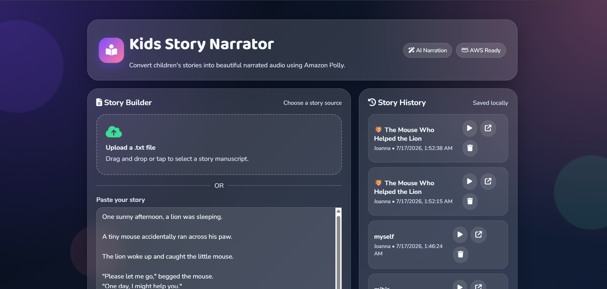
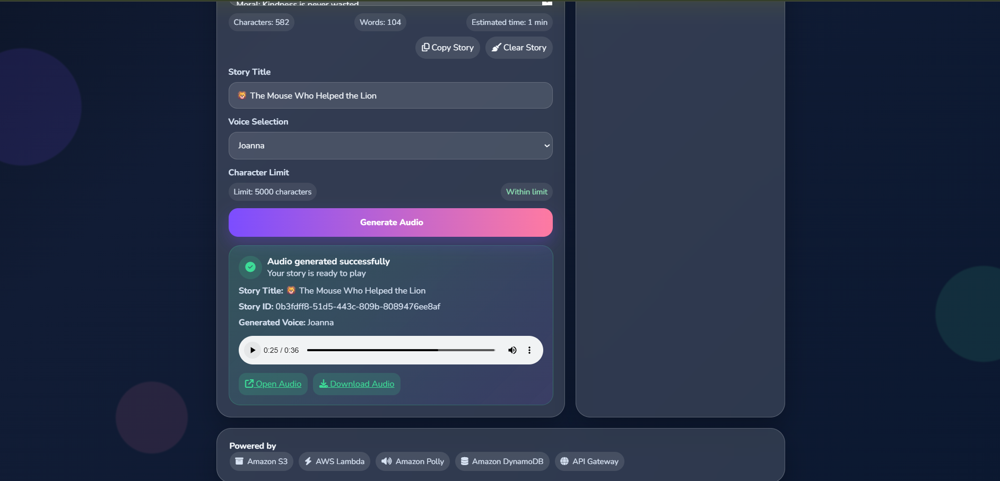

# 📚 Kids Story Narrator

A serverless web application that converts children's stories into natural-sounding speech using Amazon Polly.

---

## 🚀 Features

- Enter any children's story
- Convert text into realistic speech
- Listen directly in the browser
- Fully serverless architecture
- Fast and scalable
- Simple and user-friendly interface

---

## 🛠 Technologies Used

- AWS Lambda
- Amazon Polly
- API Gateway (HTTP API)
- IAM
- Python
- Boto3
- HTML
- CSS
- JavaScript

---

## 📂 Project Architecture

User

↓

Frontend (HTML/CSS/JavaScript)

↓

API Gateway

↓

AWS Lambda

↓

Amazon Polly

↓

MP3 Audio Response

↓

Play Audio in Browser

---

## 📸 Screenshots

### Home Page

---

### Story Input

---

### Generated Audio

---

### AWS Architecture

---

## 📦 Folder Structure

kids-story-narrator/

├── lambda_function.py

├── index.html

├── README.md

├── images/

└── assets/

---

## ▶️ How to Run

1. Create an AWS Lambda function.
2. Configure Amazon Polly permissions.
3. Create an HTTP API using API Gateway.
4. Enable CORS.
5. Deploy the Lambda function.
6. Update the API URL in `index.html`.
7. Open `index.html` in a browser.
8. Enter a story and generate audio.

---

## 💡 Use Cases

- Storytelling for children
- Learning pronunciation
- Classroom demonstrations
- Accessibility for visually impaired users
- Text-to-speech applications

---

## 🎯 Future Improvements

- Multiple voice options
- Language selection
- Story templates
- Download generated audio
- Save story history
- Background music support

---

## 👨‍💻 Author

**Mihir Wagh**